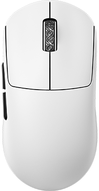
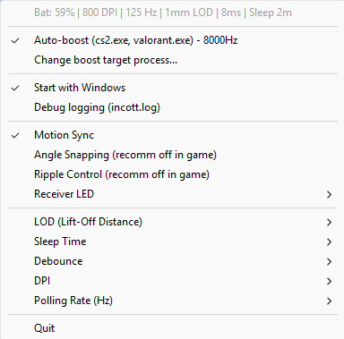

# Incott Mouse Driver

<p align="center">
  
</p>

Lightweight Windows system tray utility for **Incott** wireless mice. Communicates directly with the mouse over HID — no vendor software required. The app was built by reverse-engineering the WebHID driver and using Claude Code.

# Screenshots

<p align="center">
  
</p>

## Features

**Mouse Settings** (read from device on connect, applied instantly):
- **DPI** — 400, 800, 1600, 2400, 3200, 6400
- **Polling Rate** — 125, 250, 500, 1000, 2000, 4000, 8000 Hz
- **LOD (Lift-Off Distance)** — 0.7 mm, 1 mm, 2 mm
- **Debounce** — 0–30 ms
- **Sleep Timer** — 10 sec to 15 min
- **Motion Sync** — on/off
- **Angle Snapping** — on/off
- **Ripple Control** — on/off
- **Receiver LED Mode** — Battery status / Connect & polling rate / Battery warning

**Auto-Boost** — automatically switches polling rate to 8000 Hz when a target application is running, restores the previous value when it closes. Supports multiple apps (comma-separated, e.g. `cs2.exe, valorant.exe`).

**Status Bar** — shows battery level, current DPI, polling rate, and other settings at the top of the tray menu.

**Other:**
- Start with Windows (autostart via registry)
- Two-level logging (`incott.log`): INFO for user actions, DEBUG for HID protocol details
- **Update notifications** — checks GitHub Releases on startup; a new menu item appears when a newer version is available. Clicking it opens the release page in the browser. The repo used for checks is configurable (fork support via `update_repo` setting)
- Automatic device detection — works with Ghero, G23, G24, G23V2, Zero 29, Zero 39 (same chipset, different firmware)

## Download

Grab the latest `IncottDriver.exe` from [Releases](../../releases) — no installation needed, just run it.

Releases are built automatically by GitHub Actions on every `v*` tag push.

## Releasing a new version (for maintainers)

```bash
git tag v1.0.0
git push origin v1.0.0
```

The workflow at `.github/workflows/release.yml` runs tests, builds the Windows binary, and publishes it as a GitHub Release.

## Building from Source

### Prerequisites

- [Go 1.26+](https://go.dev/dl/)
- C compiler (CGO is required by the HID library)

### Windows 11

1. Install Go from https://go.dev/dl/

2. Install MinGW-w64 (GCC):
   ```powershell
   winget install BrechtSanders.WinLibs.POSIX.UCRT
   ```
   > **Note:** TDM-GCC 10.x is incompatible with Go 1.26+. Use WinLibs GCC 15+ or MSYS2.

3. Set the `CC` environment variable (if WinLibs is not first in PATH):
   ```powershell
   # Find the installed GCC path:
   Get-ChildItem -Path "$env:LOCALAPPDATA\Microsoft\WinGet\Packages" -Filter "gcc.exe" -Recurse | Select -First 1

   # Set it permanently for the current user:
   [System.Environment]::SetEnvironmentVariable('CC', '<path-to-gcc.exe>', 'User')
   ```

4. Clone and build:
   ```bash
   git clone https://github.com/romkazor/IncottHIDApp.git
   cd IncottHIDApp
   ```

   Build options:
   - **With Make** (recommended, runs tests first):
     ```bash
     mingw32-make build
     ```
   - **With batch script**:
     ```cmd
     build.bat
     ```
   - **Direct go build** (skips tests):
     ```bash
     go build -o IncottDriver.exe -ldflags="-H windowsgui -s -w" .
     ```
     Release builds on CI also inject the version via `-X main.version=v1.0.0` which enables the in-app update checker.

5. (Optional) Rebuild the exe icon after changing `icons/mouse.png`:
   ```bash
   pip install Pillow
   python -c "
   from PIL import Image
   img = Image.open('icons/mouse.png').convert('RGBA')
   for name, sizes in [('icons/tray_icon.ico',[16,32,48,64]), ('icons/app.ico',[16,32,48,64,128,256])]:
       icons = [img.resize((s,s), Image.LANCZOS) for s in sizes]
       icons[0].save(name, format='ICO', sizes=[(s,s) for s in sizes], append_images=icons[1:])
   "
   windres icons/app.rc -o app_windows.syso
   go build -o IncottDriver.exe -ldflags="-H windowsgui" .
   ```

### Docker (cross-compile)

Build the Windows exe from any OS using Docker:

```bash
docker run --rm -v "$(pwd):/src" -w /src \
  x1unix/go-mingw:1.24 \
  go build -o IncottDriver.exe -ldflags="-H windowsgui" .
```

> The `x1unix/go-mingw` image includes Go + MinGW-w64 cross-compiler for Windows. The resulting exe will not have the embedded Windows icon (`app_windows.syso` must be compiled with `windres` on Windows).

## Configuration

Settings are stored in `settings.json` next to the executable. The file is created automatically the first time you change a setting from the tray menu. See [`settings.json.example`](settings.json.example) for a reference.

```json
{
  "target_game_exe": "cs2.exe, valorant.exe",
  "auto_boost": true,
  "auto_start": false,
  "debug": false,
  "update_repo": "romkazor/IncottHIDApp"
}
```

| Field | Description |
|---|---|
| `target_game_exe` | Comma-separated list of processes to monitor for auto-boost |
| `auto_boost` | Enable automatic 8000 Hz when target app is detected |
| `auto_start` | Launch on Windows startup |
| `debug` | Write detailed HID protocol data to `incott.log` |
| `update_repo` | GitHub `owner/repo` used for update checks (fork support). Leave empty to use the default. |

## Supported Devices

All Incott mice sharing the same chipset (Vendor ID `0x093A`) are supported:

| Model | Product ID | Status |
|---|---|---|
| Ghero | `0x522C` / `0x622C` | Supported |
| G23 | `0x522C` / `0x622C` | Supported |
| G24 | `0x522C` / `0x622C` | Supported |
| G23V2 | `0x522C` / `0x622C` | Supported |
| Zero 29 | `0x522C` / `0x622C` | Supported |
| Zero 39 | `0x522C` / `0x622C` | Supported |

`0x522C` — wireless mode, `0x622C` — charging mode. The device model is detected automatically from the HID product name. Incott keyboards sharing the same vendor ID are automatically filtered out.

## License

[MIT](LICENSE) © romkazor
